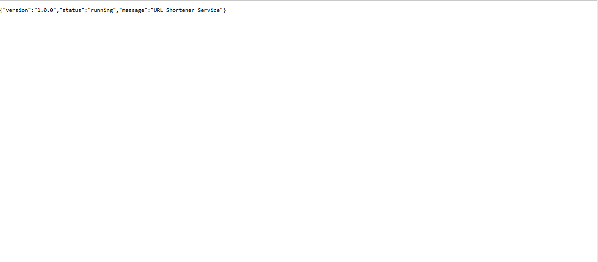
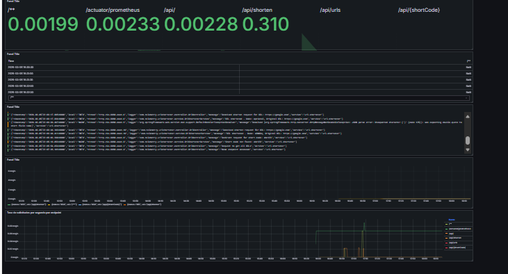
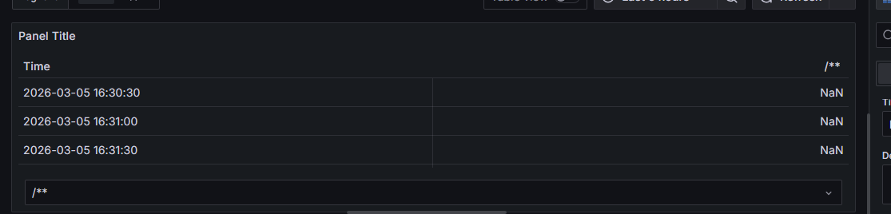
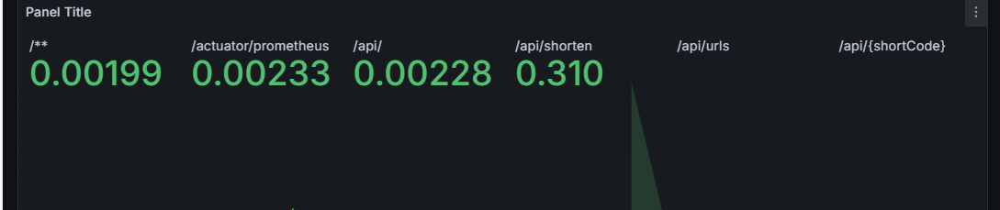
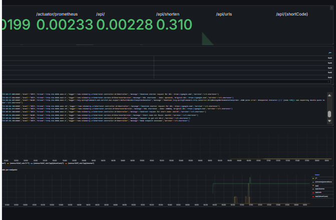

# Bitácora Experimento - Observabilidad y Monitoreo

**Nombre del estudiante:** _____________________________  
---
Cuando acabes no olvides ayudarnos evaluando tu ⭐[experiencia](https://forms.office.com/r/JCyhCpujrt)⭐
---

## Tabla de Contenidos
- [Etapa 1: Preparación del Ambiente](#etapa-1-preparación-del-ambiente)
- [Etapa 2: Métricas Iniciales](#etapa-2-métricas-iniciales)
- [Etapa 2.1: Dashboard Base en Grafana](#etapa-21-dashboard-base-en-grafana)
- [Etapa 2.2: Propuesta de Métrica Personalizada](#etapa-22-propuesta-de-métrica-personalizada)
- [Etapa 3: Experimentación y Análisis del Sistema](#etapa-3-experimentación-y-análisis-del-sistema)

---

## Etapa 1: Preparación del Ambiente

### 1.1. Información de la aplicación
DNS: 
https://nestor-lopez-c.obs-stack.eci-idp.click/api/
### 1.2. Verificación del despliegue

**¿La aplicación se desplegó correctamente?** 

- [ X ] Sí
- [ ] No

**Captura de pantalla de la aplicación funcionando:**

> _[Inserta aquí la imagen de la aplicación corriendo en /api/]_

### 1.3. Observaciones y problemas encontrados (opcional)
Me tarde un poco en encontrar el properties y me complique un poco en enteder y sacar el DNS


```


```

---

## Etapa 2: Métricas Iniciales

### 2.0.1. Generación de tráfico

**Endpoints probados:**

- [ X ] `GET /api/`
- [ X ] `POST /api/shorten`
- [ X ] `GET /api/{shortCode}`
- [ X ] `GET /api/urls`


### 2.0.2. Análisis de dos métricas relevantes

#### Métrica 1

**Nombre de la métrica:**  
```
http_server_requests_seconds_max{error="none",exception="none",method="POST",outcome="CLIENT_ERROR",status="415",uri="/api/shorten",} 0.0
```

**Tipo de métrica:** 
- [ X ] Counter
- [ ] Gauge 
- [ ] Histogram 
- [ ] Summary

**Descripción de qué información aporta:**
```

Hay una  peticion de tipo post 

```

**Relación con otras métricas (si aplica):**
```
Ejemplo: Un aumento en peticiones HTTP podría influir en el uso de CPU


```

**¿En que escenarios puede ayudar esta métrica?**
```
Puede ayudar para ver que se sube o como se sube. Basicamente lo que se va posteando


```

**¿Qué etiquetas (labels) se utilizan para agrupar los datos?**
```
Ejemplo: uri, method, status, instance, job, etc.
uri


```

---

#### Métrica 2

**Nombre de la métrica:**  
```

# TYPE system_cpu_usage gauge
system_cpu_usage 0.010492528456600314

```

**Tipo de métrica:** 
- [ ] Counter
- [ x ] Gauge 
- [ ] Histogram 
- [ ] Summary

**Descripción de qué información aporta:**
```

Se puede observar el uso de la GPU

```

**Relación con otras métricas (si aplica):**
```
Ejemplo: Un aumento en peticiones HTTP podría influir en el uso de CPU


```

**¿En que escenarios puede ayudar esta métrica?**
```

Puede ayudar para evaluar que tanta gpu se consume 

```

**¿Qué etiquetas (labels) se utilizan para agrupar los datos?**
```
--NA


```

---

## Etapa 2.1: Dashboard Base en Grafana


### 2.1.1. Evidencia: Dashboard Base en Grafana con los 4 paneles iniciales

**Captura de pantalla del dashboard:**



### 2.1.2. Visualizaciónes Adicionales (Con las metricas actuales)

#### Visualización Adicional 1

**Propósito:**
```
¿Qué quieres analizar o mostrar? Menciona qué métrica(s) vas a usar
Se quiere mostrar las request en una tabla de tal manera que se ordenen por tiempo


```


**Título del panel:**
```
Barras
```

**Consulta (PromQL o LogQL):**

```
topk(10,
sum by(uri) (rate(http_server_requests_seconds_sum{applicationName="nestor-lopez-c-monitoring"}[1m]))
/
sum by(uri) (rate(http_server_requests_seconds_count{applicationName="nestor-lopez-c-monitoring"}[1m]))
)
```

**Tipo de visualización:** 
- [ ] Time series
- [ ] Gauge
- [ ] Bar chart
- [ ] Stat
- [ ] Logs
- [ ] Otro: Table

**Otros ajustes aplicados (colores, unidades, etc.) (opcional):**
```


 se cambiaron los colores
```

**Captura de pantalla:**



**Análisis (2-3 frases):**
```
¿Qué conclusiones o patrones observas?


Aca basicamente quiero mostrar en una tabla como la orden o el orden de las peticiones mirando o basandome en el tiempo. Mirando las que mas se demoran

```

---

#### Visualización Adicional 2

**Propósito:**
```
¿Qué quieres analizar o mostrar? Menciona qué métrica(s) vas a mostrar
Aca se quiere mostrar los 10 endpoints que mas se demoran en realizar la consulta

```

**Título del panel:**
```
top 10 querys
```

**Consulta (PromQL o LogQL):**
```
topk(10,
sum by(uri) (rate(http_server_requests_seconds_sum{applicationName="nestor-lopez-c-monitoring"}[1m]))
/
sum by(uri) (rate(http_server_requests_seconds_count{applicationName="nestor-lopez-c-monitoring"}[1m]))
)
```

**Tipo de visualización:** 
- [ ] Time series
- [ ] Gauge
- [  ] Bar chart
- [ X ] Stat
- [ ] Logs
- [ ] Otro: _____

**Otros ajustes aplicados (colores, unidades, etc.) (opcional):**
```


```

**Captura de pantalla:**



**Análisis (2-3 frases):**
```
¿Qué conclusiones o patrones observas?


```

---

### 2.1.3. Análisis final del dashboard

**¿Qué otros datos te gustaría visualizar si tuvieras más información disponible?**
```


```

---

## Etapa 2.2: Propuesta de Métrica Personalizada


### Análisis y propuesta de la métrica propia (en Java)

**1. Nombre de la métrica:**


**2. Tipo de métrica:**
- [ ] Counter
- [ ] Gauge

**3. ¿Qué comportamiento mide?**
```


```

**4. ¿Por qué es relevante para el sistema?**
```


```


---

### Visualización en Grafana

**1. ¿Qué tipo de panel usaste en Grafana?**

- [ ] Time series  
- [ ] Gauge  
- [ ] Stat  
- [ ] Bar chart  
- [ X ] Otro:  TABLE

**2. ¿Qué consulta PromQL vas a utilizar?**
```promql


```

**3. ¿Cuál es el propósito de la visualización?**
```


```

---

### Panel creado en Grafana

**Captura de pantalla del panel en Grafana:**


---

## Etapa 3: Experimentación y Análisis del Sistema

### 3.1. Detección de anomalías y puntos de interés

**1. Como describirias la anomalía?**

```


```

**2. Que paneles te ayudaron a identificarlo?**

``` 


```

**3. Cual podria ser la causa de la anomalía?**

``` 


```

**Captura de pantalla del dashboard mostrando la anomalía:**

> _[Inserta aquí la imagen]_

---

### 3.2. Intento de corrección de anomalías


#### 3.2.1. Modificación del código

**Descripción del ajuste realizado:**
```
Describe en pocas palabras el ajuste realizado.


```

#### 3.2.2. Resultados después del despliegue

**¿El ajuste surtió efecto?**
- [ ] Sí 
- [ ] No 
- [ ] Parcialmente


**Captura de pantalla del dashboard después del ajuste:**

> _[Inserta aquí la imagen del estado del dashboard posterior al ajuste]_

---

### 5.7. Reflexión final

**¿Qué panel te resultó más útil para detectar problemas?**
```


```

**¿Qué métrica aporta mayor valor para monitorear un sistema real?**
```


```

**¿Qué agregarías o mejorarías en tu dashboard?**
```


```

**Fin de la bitácora**
